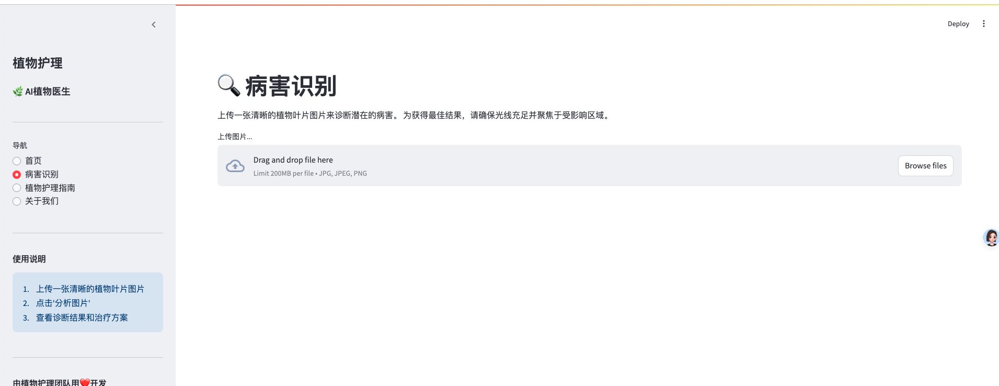
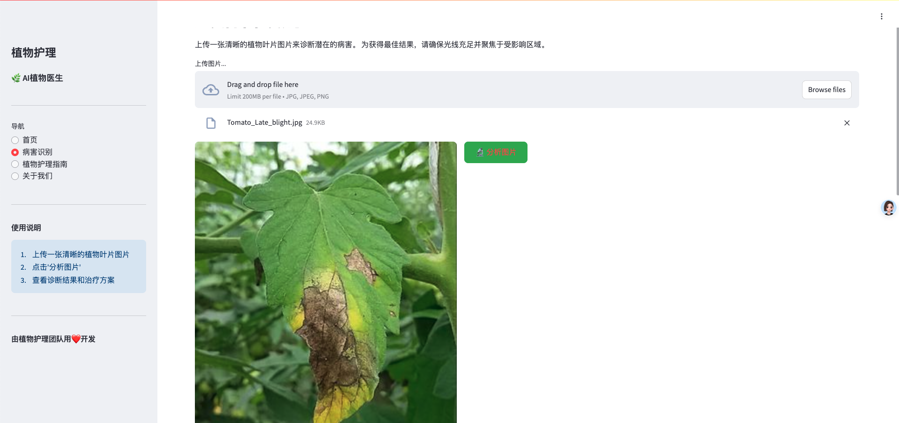
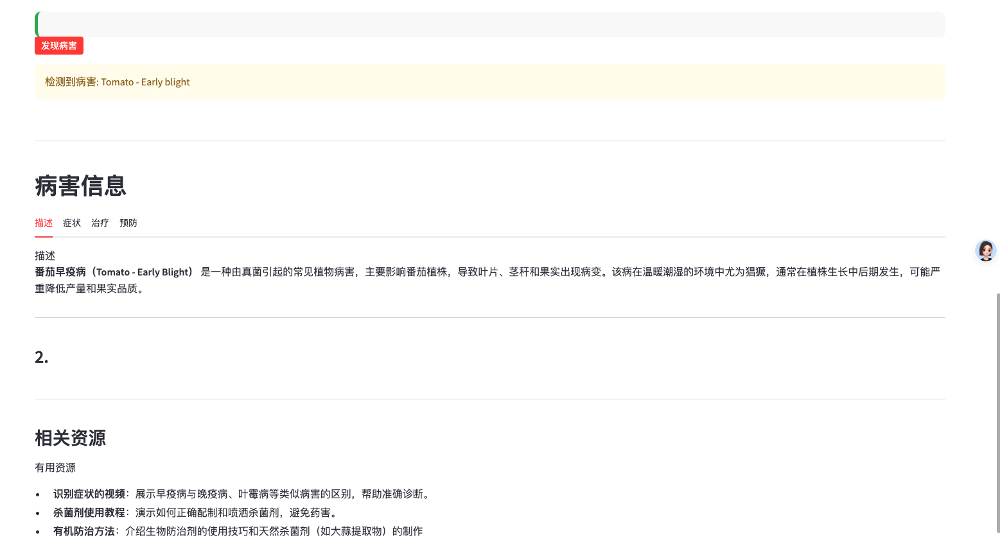

# 🌿 AI植物病害预测网络应用

一个基于网络的应用程序，使用机器学习技术从图像中检测植物病害，并提供预防建议 — 旨在帮助用户轻松准确地管理植物健康。


## 🚀 功能特点

- 🔍 **实时病害预测**：上传植物叶片图片，即时获取可能的病害预测。
- 🧠 **机器学习驱动诊断**：利用训练好的机器学习模型进行准确的植物病害分类。
- 💡 **预防建议**：为识别出的病害提供可行的治疗和预防指导。
- 🖼️ **交互式界面**：使用 [Streamlit](https://streamlit.io/) 构建直观友好的用户界面。

## 🧰 技术栈

- **前端与界面**：Streamlit
- **后端/逻辑**：Python
- **机器学习**：scikit-learn, TensorFlow/Keras（取决于具体实现）
- **其他库**：NumPy, OpenCV, pandas 等

## 🔧 本地运行方法
```
# 创建环境
python3.10 -m venv venv
source venv/bin/activate
pip install -r requirements.txt 
```

```
# 启动后台服务
python plant-disease-backend.py
# 启动前端服务
streamlit run plant-disease-front.py --server.port 8502


```
## frp 配置
```
cat /data/work/frp/frpc.ini 
vim /data/work/frp/frpc.ini

# 后台
[ssh-PlantBackend]
type = tcp
local_ip = 127.0.0.1
local_port = 8503
remote_port = 8503
use_encryption = false
use_compression = false

[ssh-PlantFront]
type = tcp
local_ip = 127.0.0.1
local_port = 8502
remote_port = 8502
use_encryption = false
use_compression = false


# 重启frp
sudo systemctl restart  supervisor
sudo supervisorctl reload
sudo supervisord
```


## 浏览器打开
http://localhost:8501/


http://39.105.194.16:8502/





# 训练
## tensorflow

```
python train/train_cnn_0.py
```